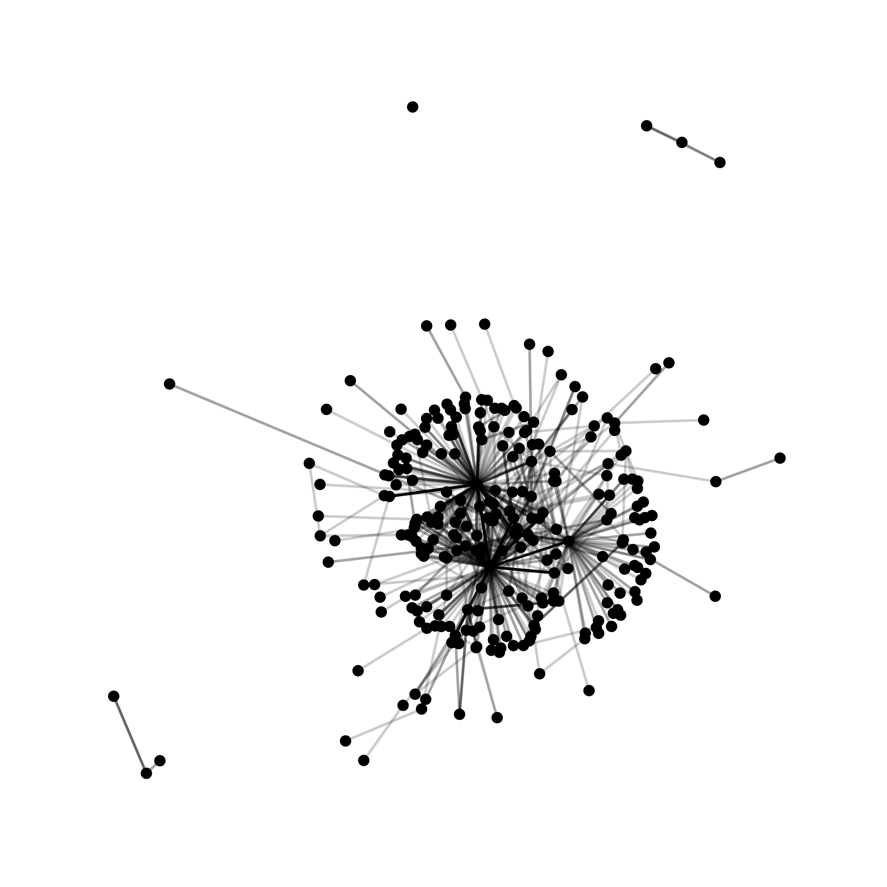
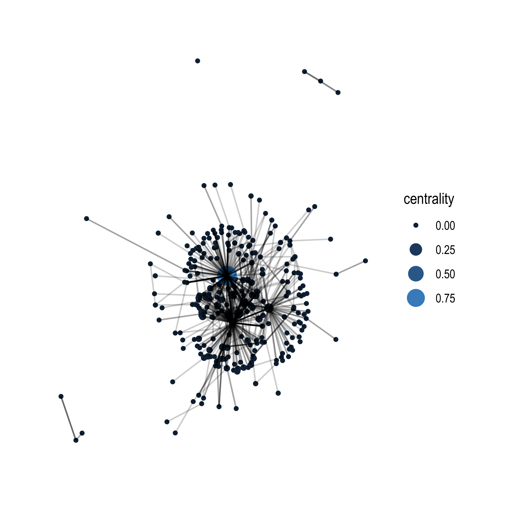

# Walkthrough 6: Exploring Relationships Using Social Network Analysis With Social Media Data {#c12}

## Topics Emphasized

- Transforming data
- Visualizing data

## Functions Introduced

- `rtweet::search_tweets()`
- `randomNames::randomNames()`
- `tidyr::unnest()`
- `tidygraph::as_tbl_graph()`
- `ggraph::ggraph()`

## Vocabulary

- Application Programming Interface (API)
- edgelist
- edge
- influence model
- regex
- selection model
- social network analysis
- sociogram
- vertex

## Chapter Overview

This chapter builds on [Walkthrough 5/Chapter 11](#c11), where we worked with #tidytuesday data. In the previous chapter we focused on using text analysis to understand the *content* of tweets. In this, we chapter focus on the *interactions* between #tidytuesday participants using social network analysis (sometimes simply referred to as network analysis) techniques. 

While social network analysis is increasingly common, it remains challenging to carry out. For one, cleaning and tidying the data can be even more challenging than for most other data sources, as net data for social network analysis (or network data) often includes variables about both individuals (such as information students or teachers) and their relationships (whether they have a relationship at all, for example, or how strong or of what type their relationship is). This chapter is designed to take you from not having carried out social network analysis through visualizing network data.

Like the previous chapter, we've also included an appendix ([Appendix C](#c20c)) to introduce some social network-related ideas for further exploration; these focus on modeling social network processes, particularly, the processes of who chooses (or selects) to interact with whom, and of influence, or how relationships can impact individuals' behaviors.

You will need a Twitter account to complete *all* of the code outlined in this chapter in order to access your own Twitter data (through the Twitter Application Interface [API]; see [Chapter 11](#c11) for an in-depth description of what this means and how to access it). 

If you do not have a Twitter account, you can create one and keep it private, or even delete the account once you're done with this walkthrough. Additionally, you can simply access data that has already been accessed from the Twitter API via the {dataedu} package (as we describe below).

### Background

There are a few reasons to be interested in social media. For example, if you work in a school district, you may want to know who is interacting with the content you share. If you are a researcher, you may want to investigate what teachers, administrators, and others do through state-based hashtags (e.g., @rosenberg2016). Social media-based data also provides new contexts for learning to take place, like in professional learning networks [@trust2016]. 

In the past, if a teacher wanted advice about how to plan a unit or to design a lesson, they would turn to a trusted peer in their building or district [@spillane2012]. Today they are as likely to turn to someone in a social media network. Social media interactions like the ones tagged with the #tidytuesday hashtag are increasingly common in education. Using data science tools to learn from these interactions is valuable for improving the student experience. 

### Packages

In this chapter, we access data using the {rtweet} package [@kearney2016]. Through {rtweet} and a Twitter account, it is easy to access data from Twitter. We will load the {tidyverse} and {rtweet} packages to get started. 

We will also load other packages that we will be using in this analysis, including two packages related to social network analysis [@R-tidygraph, @R-ggraph] as well as one that will help us to use not-anonymized names in a savvy way [@R-randomNames]. As always, if you have not installed any of these packages before (which may particularly be the case for the {rtweet}, {randomNames}, {tidygraph}, and {ggraph} packages, which we have not yet used int he book), do so using the `install.packages()` function. More on installing packages is included in the [Packages](#c06p) section of the [Foundational Skills](#c06) chapter.

Let's load the packages with the following calls to the `library()` function:


```r
library(tidyverse)
library(rtweet)
library(dataedu)
library(randomNames)
library(tidygraph)
library(ggraph)
```

### Data Sources and Import

Here is an example of searching the most recent 1,000 tweets which include the hashtag #rstats. When you run this code, you will be prompted to authenticate your access via Twitter. 


```r
rstats_tweets <- 
  search_tweets("#rstats")
```

You can easily change the search term to other hashtags terms. For example, to search for #tidytuesday tweets, we can replace #rstats with #tidytuesday: 


```r
tt_tweets  <- 
  search_tweets("#tidytuesday")
```

You can find a greater number of tweets by adding a greater value to the `n` argument of the `search_tweets()` function, as follows, to collect the most recent 500 tweets:


```r
tt_tweets  <- 
  search_tweets("#tidytuesday", n = 500)
```

You may notice that the most recent tweets containing the #tidytuesday hashtag are returned. What if you wanted to explore 

### Using an Application Programming Interface (or API)

It's worth taking a short detour to talk about how you can obtain a dataset like this. A common way to import data from websites, including social media platforms, is to use something called an Application Programming Interface (API). In fact, if you ran the code above, you just accessed an API!

Think of an API as a special door a home builder made for a house that has a lot of cool stuff in it. The home builder doesn’t want everyone to be able to walk right in and use a bunch of stuff in the house. But they also don’t want to make it too hard because, after all, sharing is caring! Imagine the home builder made a door just for folks who know how to use doors. In order to get through this door, users need to know where to find it along the outside of the house. Once they’re there, they have to know the code to open. And, once they’re through the door, they have to know how to use the stuff inside. An API for social media platforms like Twitter and Facebook are the same way. You can download datasets of social media information, like tweets, using some code and authentication credentials organized by the website.

There are some advantages to using an API to import data at the start of your education dataset analysis. Every time you run the code in your analysis, you’ll be using the API to contact the social media platform and download a fresh dataset. Now your analysis is not just a one-off product, but, rather, is one that can be updated with the most recent data (in this case, Tweets), every time you run it. By using an API to import new data every time you run your code, you create an analysis that can be used again and again on future datasets. However, A key point - and limitation - is that Twitter allows access to their data via their API only for (approximately) the seven most recent days. There are a number of *other* ways to access older data, though we focus on one way here: Having access to the URLs to (or the status IDs for) tweets. 

As a result, we used this technique - described in-depth in [Appendix B](#c20b) - to collect older (historical) data from Twitter about the #tidytuesday hashtag, using a different function than the one described above (`rtweet::lookup_statuses()` instead of `rtweet::search_tweets()`). This was important for this chapter because having acess to a greater number of tweets allows us to better understand the interactions between a larger number of the individuals participating in #tidytuesday. The data that we prepared from acessing historical data for #tidytuesday is available in the {dataedu} R package as the `tt_tweets` dataset, as we describe next.

**Accessing the data from {dataedu}***

Don't have Twitter or don't wish to access the data via Twitter? Then, you can load the data from the {dataedu} package (just as we did in the last chapter, [Chapter 11](#c11)), as follows:


```r
tt_tweets <- dataedu::tt_tweets
```

## View Data

We can see that there are *many* rows for the data:


```r
nrow(tt_tweets)
```

```
## [1] 4418
```

## Methods: Process Data

Network data requires some processing before it can be used in subsequent analyses. The network dataset needs a way to identify each participant's role in the interaction. We need to answer questions like: Did someone reach out to another for help? Was someone contacted by another for help? We can process the data by creating an *edgelist*. An edgelist is a dataset where each row is a unique interaction between two parties. Each row (which represents a single relationship) in the edgelist is referred to as an *edge*. We note that one challenge facing data scientists beginning to use network analysis is the different terms that are used for similar (or the same!) aspects of analyses: Edges are sometimes referred to as *ties* or *relations*, but these generally refer to the same thing, though they may be used in different contexts.

An edgelist looks like the following, where the `sender` (sometimes called the "nominator") column identifies who is initiating the interaction and the `receiver` (sometimes called the "nominee") column identifies who is receiving the interaction:


```
## # A tibble: 12 x 2
<<<<<<< HEAD
##    sender               receiver          
##    <chr>                <chr>             
##  1 Kargarzadeh, Makayla Gomez, Andrew     
##  2 Miera, Madeline      Rodriguez, Gabriel
##  3 Miera, Madeline      Swazo, Ariana     
##  4 Weber, Macennia      Rodriguez, Gabriel
##  5 Weber, Macennia      Gomez, Andrew     
##  6 Weber, Macennia      al-Halaby, Hamdi  
##  7 Chen, Daniel         Swazo, Ariana     
##  8 Chen, Daniel         Fritz, Shane      
##  9 Chen, Daniel         al-Halaby, Hamdi  
## 10 Baca, Karla          Newhouse, Courtney
## 11 Rea, Lauren          Swazo, Ariana     
## 12 Rea, Lauren          Newhouse, Courtney
```

In this edgelist, the sender could indicate, for example, someone who nominates someone else (the receiver) as someone they go to for help. The sender could also indicate someone who interacted with the receiver, such as by recognizing one of their tweets with a favorite (or a mention). In the following steps, we will work to create an edgelist from the data from #tidytuesday on Twitter.
=======
##    sender           receiver           
##    <chr>            <chr>              
##  1 el-Zia, Tareef   Cannon, Brian      
##  2 Mcghee, Du Shawn Alger, Alexandra   
##  3 Mcghee, Du Shawn Coop, Chantra      
##  4 Hubbard, Classie Alger, Alexandra   
##  5 Hubbard, Classie Cannon, Brian      
##  6 Hubbard, Classie Snyder, Abigale    
##  7 Green, Zachary   Coop, Chantra      
##  8 Green, Zachary   Scarborough, Chelsi
##  9 Green, Zachary   Snyder, Abigale    
## 10 Holland, Sydney  al-Hariri, Shafeeq 
## 11 Garcia, Ariyelle Coop, Chantra      
## 12 Garcia, Ariyelle al-Hariri, Shafeeq
```

In this edgelist, the `sender` column might identify someone who nominates another  (the receiver) as someone they go to for help. The sender might also identify someone who interacts with the receiver in other ways, like "liking" or "mentioning" their tweets. In the following steps, we will work to create an edgelist from the data from #tidytuesday on Twitter.
>>>>>>> origin/master

### Extracting Mentions

Let's extract the mentions. There is a lot going on in the code below; let's break it down line-by-line, starting with `mutate()`:

- `mutate(all_mentions = str_extract_all(text, regex))`: this line uses a regex, or regular expression, to identify all of the usernames in the tweet (*note*: the regex comes from from [this Stack Overflow page](https://stackoverflow.com/questions/18164839/get-twitter-username-with-regex-in-r) (https[]()://stackoverflow.com/questions/18164839/get-twitter-username-with-regex-in-r))
- `unnest(all_mentions)` this line uses a {tidyr} function, `unnest()` to move every mention to its own line, while keeping all of the other information the same (see more about `unnest()` here: [https://tidyr.tidyverse.org/reference/unnest.html](https://tidyr.tidyverse.org/reference/unnest.html))).

Now let's use these functions to extract the mentions from the dataset. Here's how all the code looks in action: 


```r
regex <- "@([A-Za-z]+[A-Za-z0-9_]+)(?![A-Za-z0-9_]*\\.)"

tt_tweets <-
  tt_tweets %>%
  # Use regular expression to identify all the usernames in a tweet
  mutate(all_mentions = str_extract_all(text, regex)) %>%
  unnest(all_mentions)
```

Let's put these into their own data frame, called `mentions`.


```r
mentions <-
  tt_tweets %>%
  mutate(all_mentions = str_trim(all_mentions)) %>%
  select(sender = screen_name, all_mentions)
```

### Putting the Edgelist Together

Recall that an edgelist is a data structure that has columns for the "sender" and "receiver" of interactions. Someone "sends" the mention to someone who is mentioned, who can be considered to "receive" it. To make the edgelist, we'll need to clean it up a little by removing the "@" symbol. Let's look at our data as it is now.


```r
mentions
```

```
## # A tibble: 2,447 x 2
##    sender  all_mentions    
##    <chr>   <chr>           
##  1 cizzart @eldestapeweb   
##  2 cizzart @INDECArgentina 
##  3 cizzart @ENACOMArgentina
##  4 cizzart @tribunalelecmns
##  5 cizzart @CamaraElectoral
##  6 cizzart @INDECArgentina 
##  7 cizzart @tribunalelecmns
##  8 cizzart @CamaraElectoral
##  9 cizzart @AgroMnes       
## 10 cizzart @AgroindustriaAR
## # … with 2,437 more rows
```

Let's remove that "@" symbol from the columns we created and save the results to a new tibble, `edgelist`.


```r
edgelist <- 
  mentions %>% 
  # remove "@" from all_mentions column
  mutate(all_mentions = str_sub(all_mentions, start = 2)) %>% 
  # rename all_mentions to receiver
  select(sender, receiver = all_mentions)
```

## Analysis and Results

Now that we have our edgelist, let's plot the network. We'll use the {tidygraph} and {ggraph} packages to visualize the data. We note that network visualizations are often referred to as *sociograms*, or a representation of the relationships between individuals in a network. We use this term and the term network visualization interchangeably in this chapter.

### Plotting the Network

Large networks like this one can be hard to work with because of their size. We can get around that problem by only include some individuals. Let's explore how many interactions each individual in the network sent by using `count()`: 


```r
interactions_sent <- edgelist %>% 
  # this counts how many times each sender appears in the data frame, effectively counting how many interactions each individual sent 
  count(sender) %>% 
  # arranges the data frame in descending order of the number of interactions sent
  arrange(desc(n))

interactions_sent
```

```
## # A tibble: 618 x 2
##    sender            n
##    <chr>         <int>
##  1 thomas_mock     347
##  2 R4DScommunity    78
##  3 WireMonkey       52
##  4 CedScherer       41
##  5 allison_horst    37
##  6 mjhendrickson    34
##  7 kigtembu         27
##  8 WeAreRLadies     25
##  9 PBecciu          23
## 10 sil_aarts        23
## # … with 608 more rows
```

618 senders of interactions is a lot! What if we focused on only those who sent more than one interaction?


```r
interactions_sent <- 
  interactions_sent %>% 
  filter(n > 1)
```

That leaves us with only 349, which will be much easier to work with. 

We now need to filter the edgelist to only include these 349 individuals. The following code uses the `filter()` function combined with the `%in%` operator to do this:


```r
edgelist <- edgelist %>% 
  # the first of the two lines below filters to include only senders in the interactions_sent data frame
  # the second line does the same, for receivers
  filter(sender %in% interactions_sent$sender,
         receiver %in% interactions_sent$sender)
```

We'll use the `as_tbl_graph()` function, which identifies the first column as the "sender" and the second as the "receiver." Let's look at the object it creates: 


```r
g <- 
  as_tbl_graph(edgelist)

g
```

```
## # A tbl_graph: 267 nodes and 975 edges
## #
## # A directed multigraph with 7 components
## #
## # Node Data: 267 x 1 (active)
##   name           
##   <chr>          
## 1 dgwinfred      
## 2 datawookie     
## 3 jvaghela4      
## 4 FournierJohanie
## 5 JonTheGeek     
## 6 jakekaupp      
## # … with 261 more rows
## #
## # Edge Data: 975 x 2
##    from    to
##   <int> <int>
## 1     1    32
## 2     1    36
## 3     2   120
## # … with 972 more rows
```

We can see that the network now has 267 individuals, all of which sent more than one interaction. The individuals in a network are often referred to as *nodes* (and, this terminology is used in the {ggraph} functions for plotting the individuals - the nodes - in a network). We note that nodes are sometimes referred to as *vertices* or *actors*; like the different names for edges, these generally mean the same thing. 

Next, we'll use the `ggraph()` function:


```r
g %>%
  # we chose the kk layout as it created a graph which was easy-to-interpret, but others are available; see ?ggraph
  ggraph(layout = "kk") +
  # this adds the points to the graph
  geom_node_point() +
  # this adds the links, or the edges; alpha = .2 makes it so that the lines are partially transparent
  geom_edge_link(alpha = .2) +
  # this last line of code adds a ggplot2 theme suitable for network graphs
  theme_graph()
```

<<<<<<< HEAD
<div class="figure" style="text-align: center">

=======
<div class="figure">

>>>>>>> origin/master
<p class="caption">(\#fig:fig12-1)Network Graph</p>
</div>

Finally, let's size the points based on a measure of centrality. A common way to do this is to measure how influential an individual may be based on the interactions observed.


```r
g %>% 
  # this calculates the centrality of each individual using the built-in centrality_authority() function
  mutate(centrality = centrality_authority()) %>% 
  ggraph(layout = "kk") + 
  geom_node_point(aes(size = centrality, color = centrality)) +
  # this line colors the points based upon their centrality
  scale_color_continuous(guide = 'legend') + 
  geom_edge_link(alpha = .2) +
  theme_graph()
```

<<<<<<< HEAD
<div class="figure" style="text-align: center">

=======
<div class="figure">

>>>>>>> origin/master
<p class="caption">(\#fig:fig12-2)Network Graph with Centrality</p>
</div>

There is much more you can do with {ggraph} (and {tidygraph}); check out the {ggraph} tutorial here: [https://ggraph.data-imaginist.com/](https://ggraph.data-imaginist.com/)

## Conclusion

<<<<<<< HEAD
In this chapter, we used social media data (from the #tidytuesday hashtag) to prepare and visualize social network data. This is a powerful technique; one that can reveal who is interacting with whom, and one that can begin to suggest why.

<!-- Wondering if we need to do more with the visualizations do begin so that this can be more warranted. -->

Behind these visualizations, though, there are also statistical models and methods that can help to understand what is going on with respect to particular relationships in a network in additional ways.

One way to consider these models and methods is in terms of two *processes* at play in our relationships (cite). These two processes are commonly (though not exclusively) the focus of statistical analyses of networks. In addition to not being exclusive, they do not interact independently: they affect each other reciprocally (Xu, Frank, & Penuel, 2018). They are:

- *Selection*: the processes regarding who chooses to have a relationship with whom
- *Influence*: the processes regarding how who we have relationships with affects our behavior

While these are complex, they can be studied with the type of data collected from asking people about their relationships (and possibly asking them about or studying their behavior--or measuring some outcome). Happily, the use of these methods has expanded along with R: many of the best tools for studying social networks are in the form of long-standing R packages. Additionally, while there are many potential nuances to studying selection and influence, these are models that can fundamentally be carried out with regression, or the linear model (or extensions of it). We describe these in the *Technical Appendix* for this chapter, as they do not use the tidytuesday dataset and are likely to be of interest to readers only after having mastered preparing and visualizing network data.

## Technical Appendix: Influence and Selection Models

As noted above, there is much more to understanding interactions, and network analysis, beyond creating edgelists and visualizing network data (through the use of an edgelist). Two processes that are particularly important (and able to be studied with network data using R) are for influence and selection.

### An Example of Influence

First, let's look at an example of influence. To do so, let's create three different data frames. Here is what they should, at the end of the process, contain:

- A data frame indicating who the *nominator* and *nominee* for the relation (i.e., if Stefanie says that José is her friend, then Stefanie is the nominator and José the nominee) - as well as an optional variable indicating the weight, or strength, of their relation.
- This data frame and its type can be considered the basis for many types of social network analysis and is a common structure for network data: it is an *edgelist*.
- Data frames indicating the values of some behavior - an outcome - at two different time points.

In this example, we create some example data that can be used to explore questions about how influence works.

Let's take a look at the merged data. What this data now contains is the first data frame, `data1`, with each nominees' outcome at time 1 (`yvar1`). Note that we will find each nominators' outcome at time 2 later on.


```r
data1 <-
  data.frame(
    nominator = c(2, 1, 3, 1, 2, 6, 3, 5, 6, 4, 3, 4),
    nominee = c(1, 2, 2, 3, 3, 3, 4, 4, 4, 5, 6, 6),
    relate = c(1, 1, 1, 1, 1, 1, 1, 1, 1, 1, 1, 1)
  )

data2 <-
  data.frame(nominee = c(1, 2, 3, 4, 5, 6),
             yvar1 = c(2.4, 2.6, 1.1, -0.5, -3, -1))

data3 <-
  data.frame(nominator = c(1, 2, 3, 4, 5, 6),
             yvar2 = c(2, 2, 1, -0.5, -2, -0.5))
```

### Joining the Data

Next, we'll join the data into one data frame. Note that while this is sometimes tedious and time-consuming, especially with large sources of network data, it is a key step for being able to carry out network analysis - often, even for creating visualizations that are informative.


```r
data <-
  left_join(data1, data2, by = "nominee")

data <-
  data %>% 
  # this makes merging later easier
  mutate(nominee = as.character(nominee)) 

# calculate indegree in tempdata and merge with data
tempdata <- data.frame(table(data$nominee))

tempdata <-
  tempdata %>%
  rename(
    # rename the column "Var1" to "nominee" 
    "nominee" = "Var1", 
    # rename the column "Freq" to "indegree"
    "indegree" = "Freq"
    ) %>% 
  # makes nominee a character data type, instead of a factor, which can cause problems
  mutate(nominee = as.character(nominee))

data <- 
  left_join(data, tempdata, by = "nominee")
```

**Calculating an Exposure Term**

This is the key step that makes this model - a regression, or linear, model - one that is special. It is creating an exposure term. The idea is that the exposure term "captures" how your interactions with someone, over some period of time (between the first and second time points) impact some outcome. This model accounts for an individual's initial report of the outcome, i.e., their time 1 prior value, so it is a model for *change* in some outcome.


```r
# Calculating exposure
data <-
  data %>% 
  mutate(exposure = relate * yvar1)

# Calculating mean exposure
mean_exposure <-
  data %>%
  group_by(nominator) %>%
  summarize(exposure_mean = mean(exposure))
```

What this data frame - `mean_exposure` - contains is the mean of the outcome (in this case, `yvar1`) for all of the individuals the nominator had a relation with.

As we need a final data set with `mean_exposure`,`degree`, `yvar1`, and `yvar2` added, we'll process the data a bit more.


```r
data2 <-
  data2 %>% 
  # rename nominee as nominator to merge these
  rename("nominator" = "nominee") 

final_data <-
  left_join(mean_exposure, data2, by = "nominator")

final_data <- 
  # data3 already has nominator, so no need to change
  left_join(final_data, data3, by = "nominator") 
```

**Regression (Linear Model)**

Calculating the exposure term is the most distinctive and important step in carrying out influence models. Now, we can simply use a linear model to find out how much relations - as captured by the influence term - affect some outcome.


```r
model1 <-
  lm(yvar2 ~ yvar1 + exposure_mean, data = final_data)

summary(model1)
```

```
## 
## Call:
## lm(formula = yvar2 ~ yvar1 + exposure_mean, data = final_data)
## 
## Residuals:
##        1        2        3        4        5        6 
##  0.02946 -0.09319  0.09429 -0.02730 -0.02548  0.02222 
## 
## Coefficients:
##               Estimate Std. Error t value Pr(>|t|)    
## (Intercept)    0.11614    0.03445   3.371   0.0434 *  
## yvar1          0.67598    0.02406  28.092  9.9e-05 ***
## exposure_mean  0.12542    0.03615   3.470   0.0403 *  
## ---
## Signif. codes:  0 '***' 0.001 '**' 0.01 '*' 0.05 '.' 0.1 ' ' 1
## 
## Residual standard error: 0.08232 on 3 degrees of freedom
## Multiple R-squared:  0.9984,	Adjusted R-squared:  0.9974 
## F-statistic: 945.3 on 2 and 3 DF,  p-value: 6.306e-05
```

So, the influence model is used to study a key process for social network analysis, but it is one that is useful, because you can quantify, given what you measure and how you measure it, *the network effect*, something that is sometimes not considered, especially in education (Frank, 2009). It's also fundamentally a regression. That's really it, as the majority of the work goes into calculating the exposure term.

### An Example of Selection

Selection models are also commonly used - and are commonly of interest not only to researchers but also to administrators and teachers (and even to youth and students). 

Here, we briefly describe a few possible approaches for using a selection model.

At its core, the selection model is a regression - albeit, one that is a generalization of one, namely, a logistic regression (sometimes termed a generalized linear model, because it is *basically* a regression but is one with an outcome that consists just of 0's and 1's). Thus, the most straight-away way to use a selection model is to use a logistic regression where all of the relations (note the `relate` variable in `data1` above) are indicated with a 1. But, here is the important and challenging step: all of the *possible relations* (i.e., all of the relations that are possible between all of the individuals in a network) are indicated with a 0 in an edgelist. Note that, again, an edgelist is the preferred data structure for carrying out this analysis. This step involves some data wrangling, especially the idea of widening or lengthening a data frame.

Once all of the relations are indicated with a 1 or a 0, then a simple linear regression can be used. Imagine that we are interested in whether individuals from the *same* group are more or less likely to interact than those from different groups; same could be created in the data frame based upon knowing which group both nominator and nominee are from:


```r
m_selection <- 
  glm(relate ~ 1 + same, data = edgelist1)
```

While this is a straightforward way to carry out a selection model, there are some limitations to it. Namely, it does not account for individuals who send more (or less) nominations overall--and not considering this may mean other effects, like the one associated with being from the *same* group, are not accurate. A few extensions of the linear model - including those that can use data for which relationships are indicated with weights, not just 1's and 0's, have been developed. 
=======
In this chapter, we used social media data from the #tidytuesday hashtag to prepare and visualize social network data. Sociograms are a useful visualization tool to  reveal who is interacting with whom--and, in some cases, to suggest why. In our applications of data science, we have found that the individuals (such as teachers or students) who are represented in a network often like to see what the network (and the relationships in it) *look like*. It can be compelling to think about why networks are the way they are, and how changes could be made to - for example - foster more connections between individuals who have few opportunities to interact. In this way, social network analysis can be useful to the data scientist in education because it provides a technique to communicate with other educational stakeholders in a compelling way.
>>>>>>> origin/master

Social network analysis is a broad (and growing) domain, and this chapter was intended to present some of its foundation. Fortunately for R users, many recent developments are implemented first in R (e.g., @R-amen). If you are interested in some of the additional steps that you can take to model and analyze network data, consider the appendix on two types of models (for selection and influence processes), [Appendix C](#c20c).
